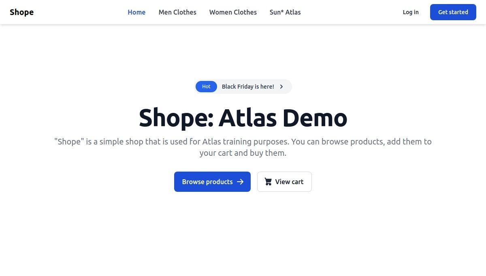

# shope-shop

Simple shop is used for Sun\* Atlas's training purposes. [Shope API Docs](https://sun-asterisk-research.github.io/shope-shop/).



## Development

Start all dev containers for development mode:

```bash
devspace dev -p dev
```

Or start dev container for one:

```bash
# start api container:
devspace dev -p dev --dependency api

# start web ui container:
devspace dev -p dev --dependency ui
```

## Deploy

- For local deployment:

```bash
devspace deploy
```

- For production deployment:

```bash
devspace deploy -p production
```
